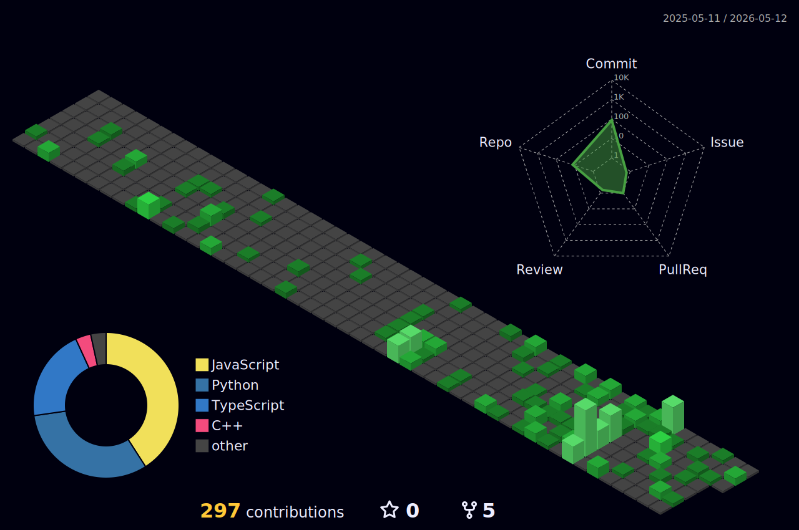

<h1 align="center">
    
</h1>

    

<!-- ───────────────────────────── ABOUT ME ───────────────────────────── -->

## 💫 About Me

Student developer interested in **Agentic AI**, full-stack development, and applied ML. I like building things that work end to end,from the UI to the model.

Currently exploring autonomous AI systems that can reason, plan, and act on their own 🤖. When I'm not coding, I'm probably crocheting 🧶.

<!-- ───────────────────────── TECH STACK ─────────────────────────── -->

## 🛠️ Tech Stack

<table>
  <tr>
    <td><b>Languages</b></td>
    <td>
      
    </td>
  </tr>
  <tr>
    <td><b>Frontend</b></td>
    <td>
      
    </td>
  </tr>
  <tr>
    <td><b>Backend & DB</b></td>
    <td>
      
    </td>
  </tr>
  <tr>
    <td><b>AI / ML</b></td>
    <td>
      
      &nbsp;
      
      
    </td>
  </tr>
  <tr>
    <td><b>Tools</b></td>
    <td>
      
    </td>
  </tr>
  <tr>
    <td><b>Cloud</b></td>
    <td>
      
    </td>
  </tr>
</table>

<!-- ──────────────────── CONTRIBUTION CITY ───────────────────────── -->

## 🏙️ 3D Contribution City

    <picture>
        <source media="(prefers-color-scheme: dark)" srcset="./profile-3d-contrib/profile-night-green.svg" />
        <source media="(prefers-color-scheme: light)" srcset="./profile-3d-contrib/profile-green-animate.svg" />
        
    </picture>

<!-- ──────────────────────── GITHUB STATS ────────────────────────── -->

## 📊 GitHub Stats

    
    

    

<!-- ──────────────────────── DEV QUOTE ───────────────────────────── -->

## ✍️ Random Dev Quote

    

<!-- ──────────────────────── CONNECT ─────────────────────────────── -->

## 🤝 Connect with Me

    &nbsp;
    &nbsp;
    

<!-- ──────────────────────── FOOTER ──────────────────────────────── -->

